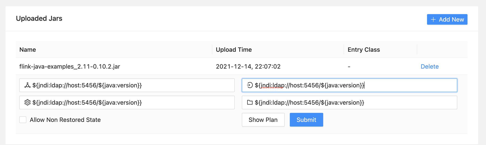

# apache flink

- Version: `1.14.0`
- Auth required: No

## details

Can be triggered after uploading an example job (download the jar [here](https://search.maven.org/artifact/org.apache.flink/flink-java-examples_2.11/0.10.2/jar)), poisoning the 4 fields and then hitting "Show Plan".

## run

```bash
docker run --rm --name flink -p 8081:8081 --env FLINK_PROPERTIES="jobmanager.rpc.address: jobmanager" flink:1.14.0 jobmanager
```

## example



