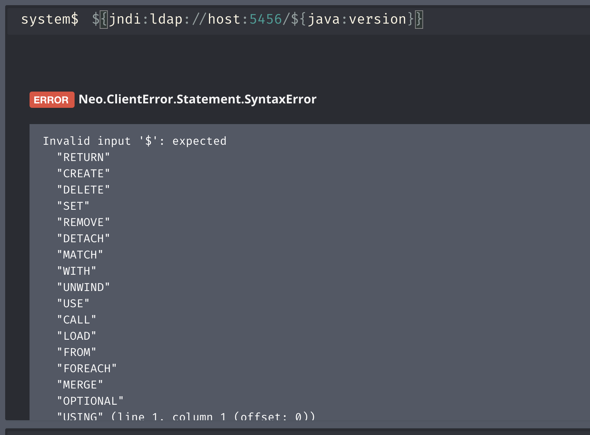

# neo4j enterprise

- Version: `4.2.8-enterprise`
- Auth required: Yes

## details

Can be triggered with any query (even if syntactically incorrect) as a result of the query log that is enabled by default in the enterprise version of neo4j.

## run

```bash
docker run -p 7474:7474 -p 7687:7687 -e NEO4J_ACCEPT_LICENSE_AGREEMENT=yes neo4j:4.2.8-enterprise
```

## example


