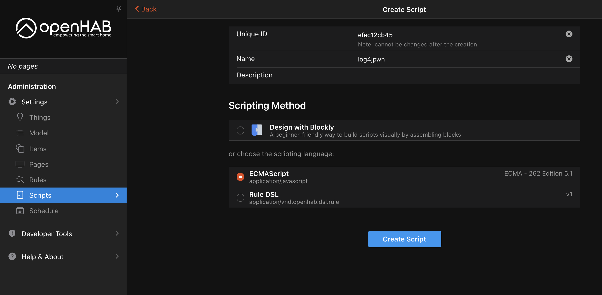

# openhab

- Version: `3.1.0`
- Auth required: Yes

## details

Can be triggered by creating and running an EMCA script.

## run

```bash
docker run --rm -p8080:8080 openhab/openhab:3.1.0
```

## example




